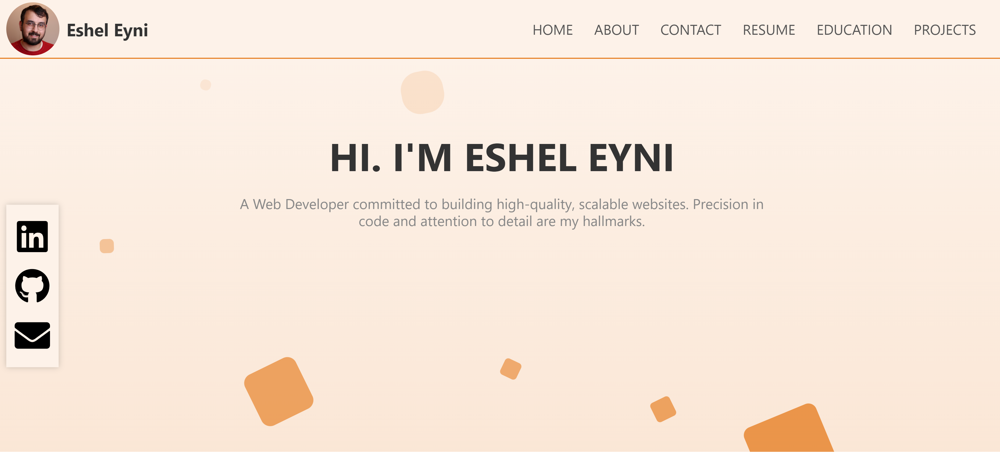

# My Portfolio

Welcome to my portfolio, a comprehensive showcase of my professional journey as a developer. This portfolio is an amalgamation of my work, encapsulating various projects I've undertaken, detailing my skill set and the technologies I've mastered. Each project is presented with thorough documentation and code snippets, giving insights into my problem-solving methods and coding style. Additionally, my resume is included, offering a chronological overview of my educational background and professional experiences. The portfolio also features a curated list of courses I've completed, demonstrating my commitment to continuous learning and staying abreast of the latest industry trends. Dive into this repository of my career milestones and discover how I've evolved as a developer.

Here is the link to the website: [Porfolio](https://esheleyni.netlify.app/home)

